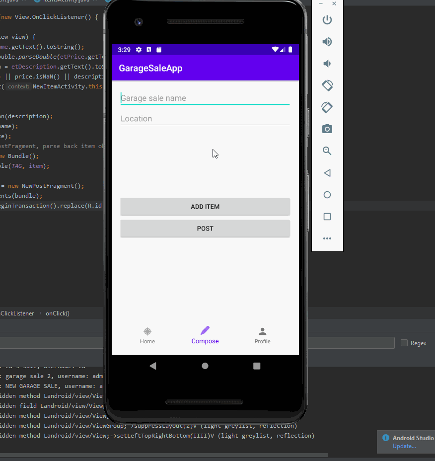

# GarageSaleApp

## Table of Contents
1. [Overview](#Overview)
1. [Product Spec](#Product-Spec)
1. [Wireframes](#Wireframes)
2. [Schema](#Schema)

## Overview
### Description
Allows users to upload their garage sale location as well as the items that they are selling. Other uses that are looking at the garage sale can buy the items on sale.

### App Evaluation 
[Evaluation of your app across the following attributes]
- **Category:** Online Shopping
- **Mobile:** Having this on mobile gives users the convenience to search for garage sales near the area as well as ability to sell their items
- **Story:** 
- **Market:** Anyone that wants to get more publicity on their garage sale as well as those who are on the lookout on cheap/free second hand items  
- **Habit:** Users can browse through garage sales and buy items. Users can also list their garage sale and items.
- **Scope:** 
- V1 User can create a garage sale and items to sell, other users will be able to see the garage sales and purchase items. 
- V2 Garage sale location can be seen via Google maps (If time permits)

## Product Spec

### 1. User Stories (Required and Optional)

**Required Must-have Stories**

 * Set up the Database with Parse [x]
 * Login [x]
 * Home Screen that shows all the garage sales itens [x]
 * Able to click on garage sale item for details and purchase [x]
 
 ------------------------------------------------------------------
 TODO
 * Able to make a new listing item
 * See a list of items purchase in profile
 * See a list of items that you are selling in profile
 * Logout, Signout 

 ### Video
 
 
**Optional Nice-to-have Stories**

 * Filter the Garage Sales in Home Screen

### 2. Screen Archetypes

 * Login Screen
   * Enter username and password to log into your account
   * Signup button if you don't have an account
 * Signup Screen
   * Enter a unique username
   * Enter a strong password
 * List of items (Home Page)
   * Show a list of all items that are being sold
   * Navigation tab with home, new item, profile
 * Item Page
   * Name of garage sale
   * Description of the item being sold
   * Able to purchase it
 * New Listing Page
   * Set the name of your garage sale
   * Have a list of your items
   * Button to add a new item
 * New Item Page
   * Updload an image of the item
   * Description and other labels needed
   * Button to add the item
 * Profile Page
   * A list of items that you have purchased
   * A list of items that you are selling
   * A logout button

### 3. Navigation

**Tab Navigation** (Tab to Screen)

 * Home
 * New Item
 * Profile

**Flow Navigation** (Screen to Screen)

 * Login Page -> Home Screen
 * Login Page -> Signup Page -> Login Page
 * Home Page -> Item Page
 * New Listing Page -> New Item Page
 * New Item Page -> Home Screen
 
   
## Wireframes


### [BONUS] Digital Wireframes & Mockups

### [BONUS] Interactive Prototype

## Schema 

### Models
#### User

   | Property      | Type     | Description |
   | ------------- | -------- | ------------|
   | objectId      | String   | Unique ID provided by Parse |
   | username      | String   | Username of user |
   | password      | String   | Password of user |
   | purchased     | Array    | List of items the user has bought |
   
#### Post

   | Property      | Type     | Description |
   | ------------- | -------- | ------------|
   | objectId      | String   | unique id for the team (default field) |
   | userID        | Pointer  | Connect the post to its respective user |
   | location      | String   | Location of the garage sale post |
   | name          | String   | Name of the garage sale |
   | createdAt     | DateTime | Automatic date by Parse |
   | closed        | Bool     | Know if the post is concluded |
   
#### Item

   | Property      | Type     | Description |
   | ------------- | -------- | ------------|
   | objectId      | String   | unique id for the team (default field) |
   | postID        | Pointer  | Pointer to the post |
   | image         | File     | Image of the item being sold |
   | name          | String   | Name of the item |
   | price         | Number   | Price of the item |
   | description   | String   | Description of the garage sale item sale |
   | sold          | Boolean  | Check if item has been sold or not |

### Networking

- Login Screen
  - (Read/GET) Query to login if user exists
  - (Create/POST) Query to create new user
```Swift
// For creating a new user
ParseUser user = new ParseUser();
user.setUsername(username);
user.setPassword(password);
user.signUpInBackground(new SignUpCallback() {
  @Override
  public void done(ParseException e) {
      if (e == null){
          Toast.makeText(LoginActivity.this, "Successfully signed up!", Toast.LENGTH_SHORT).show();
          goMainActivity();
      }
      else{
          Toast.makeText(LoginActivity.this, "Signup error, something went wrong " + e, Toast.LENGTH_SHORT).show();
          return;
      }
  }
});
```
- Home Feed Screen
  - (Read/GET) Query to get all garage sale listings
  - (Create/POST) Create a new Garage Sale
```Swift
// Query to get all garage sale listings
ParseQuery<Post> query = ParseQuery.getQuery(Post.class);
query.include(Post.KEY_USER);
query.setLimit(20);
query.addDescendingOrder(Post.KEY_CREATED);
query.include(Post.KEY_USER);
query.findInBackground(new FindCallback<Post>() {
  @Override
  public void done(List<Post> posts, ParseException e) {
      if (e != null){
          Log.e(TAG, "Issue with getting posts", e);
      }
      for (Post post:posts){
          Log.i(TAG, "Post: " + post.getDescription() + ", username: " + post.getUser().getUsername());
      }
      allPosts.addAll(posts);
      adapter.notifyDataSetChanged();
  }
});
```
- New Listing Screen
  - (Create/POST) Create a new garage sale object
  - (Read/GET) Query to get all the list of items in the garage sale
- New Item Screen
  - (Create/POST) Create a new garage sale item object
